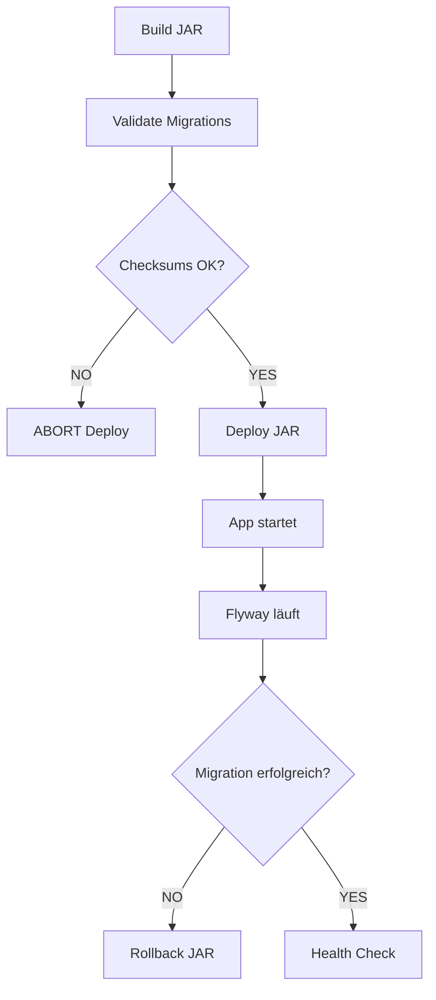

# Flyway Migration Strategy - Production Safe

## Problem: Checksum Mismatch

**Fehler:**
```
Migration checksum mismatch for version 1
```

**Ursache:**
- V1__initial_schema.sql wurde NACH dem ersten Deployment geändert
- Flyway speichert Checksums in `flyway_schema_history`
- Bei Änderungen erkennt Flyway die Diskrepanz und bricht ab

---

## LÖSUNG: Immutable Migrations Strategy

### 1. **NIEMALS existierende Migrationen ändern**

❌ **FALSCH:**
```
V1__initial_schema.sql  (deployed)
↓ (editiert)
V1__initial_schema.sql  (geändert) → CHECKSUM MISMATCH!
```

✅ **RICHTIG:**
```
V1__initial_schema.sql     (deployed, IMMUTABLE)
V2__add_new_column.sql     (neue Migration)
V3__add_index.sql          (neue Migration)
```

---

### 2. **Migration Folder Structure**

```
src/main/resources/db/migration/
├── V1__initial_schema.sql           ✅ LOCKED (nicht mehr ändern!)
├── V2__initial_data.sql              ✅ LOCKED
├── V3__setup_permissions.sql         ✅ LOCKED
├── V4__add_delivery_tables.sql       ✅ LOCKED
├── V5__fix_missing_indexes.sql       ← NEUE Migration (Fixes aus V1)
└── README.md                         ← Dokumentation
```

---

### 3. **Flyway Repair Strategy**

**Für Production Deployments:**

```bash
# Option A: Automatischer Repair (VORSICHT!)
flyway repair  # Löscht failed migrations, updated checksums

# Option B: Manuelle Checksum-Korrektur (SICHER)
UPDATE flyway_schema_history 
SET checksum = <neuer_checksum> 
WHERE version = '1';

# Option C: Baseline neu setzen (GEFÄHRLICH!)
flyway baseline  # Nur für frische Installationen!
```

---

### 4. **Best Practices**

#### ✅ DO:
1. **Neue Migrationen für Änderungen:**
   - `V5__add_missing_column.sql`
   - `V6__fix_constraint.sql`

2. **Idempotente SQL:**
   ```sql
   CREATE TABLE IF NOT EXISTS ...
   CREATE INDEX IF NOT EXISTS ... (via DO-Block)
   ```

3. **Testen vor Production:**
   ```bash
   # Lokal testen
   ./mvnw flyway:validate
   ./mvnw flyway:info
   ```

4. **Checksum-Validierung in CI/CD:**
   ```bash
   ./mvnw flyway:validate || exit 1
   ```

#### ❌ DON'T:
1. **Niemals deployed Migrations ändern**
2. **Keine manuelle Schema-Änderungen** (nur via Migrations)
3. **Kein `flyway:clean` in Production** (löscht ALLE Daten!)
4. **Kein `baseline-on-migrate` wenn Schema bereits existiert**

---

### 5. **Production Deployment Flow**



---

### 6. **Flyway Configuration für Production**

```yaml
spring:
  flyway:
    enabled: true
    baseline-on-migrate: false  # ❌ Nur beim ERSTEN Deployment!
    baseline-version: 0
    validate-on-migrate: true   # ✅ Checksums prüfen
    out-of-order: false         # ✅ Reihenfolge erzwingen
    ignore-missing-migrations: false  # ✅ Fehlende Migrations = Fehler
    ignore-ignored-migrations: false
    ignore-future-migrations: false   # ✅ Neuere Versionen = Fehler
    clean-disabled: true        # ✅ KRITISCH: Kein Clean in Prod!
```

---

### 7. **Recovery Scenarios**

#### Szenario 1: Checksum Mismatch in Production
```bash
# SSH auf VPS
ssh user@vps

# Option 1: Repair (safe)
sudo systemctl stop storebackend
cd /opt/storebackend
java -jar app.jar --spring.flyway.repair=true --spring.profiles.active=production
# Dann normale Deployment

# Option 2: Manuelle DB-Korrektur
sudo -u postgres psql -d storedb
UPDATE flyway_schema_history SET checksum = -1234567890 WHERE version = '1';
\q
sudo systemctl start storebackend
```

#### Szenario 2: Migration Failed
```bash
# Flyway markiert Migration als "FAILED"
# Lösung: Repair + Fix + Re-deploy

# 1. Stop App
sudo systemctl stop storebackend

# 2. Delete FAILED entry
sudo -u postgres psql -d storedb -c "
DELETE FROM flyway_schema_history WHERE success = false;
"

# 3. Fix Migration (neues V5 statt V4 editieren!)
# 4. Re-deploy
```

#### Szenario 3: Out-of-Order Migration
```bash
# DEV hat V5, PROD hat nur V3
# Fehler: "out of order migration"

# Lösung: out-of-order erlauben (temporär)
spring.flyway.out-of-order=true  # NUR für diesen Deploy!
# Danach wieder auf false
```

---

### 8. **Naming Convention**

```
V<VERSION>__<description>.sql

Beispiele:
✅ V1__initial_schema.sql
✅ V2__add_user_table.sql
✅ V10__fix_index_performance.sql
✅ V2025_01_30_14_30__hotfix_prod_issue.sql  (Timestamp für Hotfixes)

❌ V1__initial_schema.sql  (dann editiert)
❌ V001__migration.sql  (führende Nullen vermeiden)
❌ V1.0__migration.sql  (keine Punkte)
```

---

### 9. **Testing Strategy**

```bash
# Lokal: Test gegen H2
./mvnw clean test

# Lokal: Test gegen PostgreSQL (Testcontainer)
./mvnw verify -Ptest-postgres

# CI/CD: Validate Checksums
./mvnw flyway:validate

# CI/CD: Show Migration Info
./mvnw flyway:info
```

---

### 10. **Emergency Procedures**

#### Complete Flyway Reset (NUR Entwicklung!)
```bash
# ⚠️ LÖSCHT ALLE DATEN!
./mvnw flyway:clean
./mvnw flyway:migrate
```

#### Production Baseline (Existing Database)
```bash
# Für existierende Production DB ohne Flyway History
./mvnw flyway:baseline -Dflyway.baselineVersion=1 -Dflyway.baselineDescription="Initial baseline"
```

---

## Zusammenfassung

| Regel | Beschreibung |
|-------|--------------|
| **IMMUTABLE** | Deployed Migrations NIEMALS ändern |
| **INCREMENTAL** | Neue Vx für jede Änderung |
| **VALIDATE** | Checksums in CI/CD prüfen |
| **IDEMPOTENT** | SQL mehrfach ausführbar |
| **REPAIR** | Bei Checksums: `flyway repair` |
| **NO CLEAN** | `clean-disabled: true` in Production |
| **TEST** | Migrations lokal testen vor Deploy |

---

**Autor:** GitHub Copilot  
**Datum:** 2026-01-30  
**Version:** 1.0 - Production Safe Flyway Strategy

