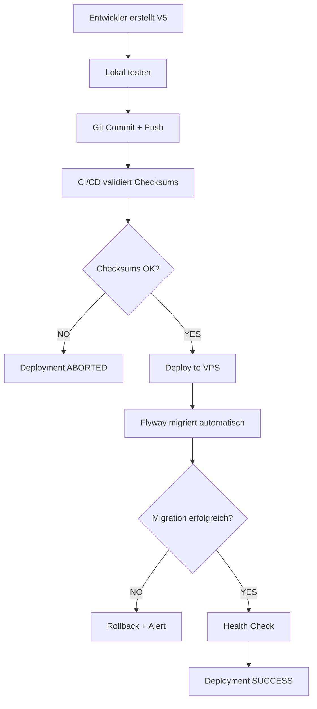

# Database Migrations - Flyway

## 📁 Ordnerstruktur

```
src/main/resources/db/migration/
├── V1__initial_schema.sql           ✅ IMMUTABLE (deployed 2026-01-30)
├── V2__initial_data.sql              ✅ IMMUTABLE (deployed 2026-01-30)
├── V3__setup_permissions.sql         ✅ IMMUTABLE (deployed 2026-01-30)
├── V4__add_delivery_tables.sql       ✅ IMMUTABLE (deployed 2026-01-30)
├── V5__example_new_feature.sql       ← Template für neue Migrations
└── README.md                         ← Diese Datei
```

---

## ⚠️ WICHTIGE REGELN

### 1. **NIEMALS deployed Migrations ändern!**

❌ **FALSCH:**
```bash
# V1 bereits deployed
vim V1__initial_schema.sql  # ❌ NICHT ÄNDERN!
git commit -m "fix V1"      # ❌ Führt zu Checksum Mismatch!
```

✅ **RICHTIG:**
```bash
# Neue Migration für Änderung erstellen
vim V5__fix_missing_column.sql
git commit -m "feat: add missing column via V5"
```

---

### 2. **Naming Convention**

```
V<VERSION>__<description>.sql

Beispiele:
✅ V1__initial_schema.sql
✅ V5__add_user_preferences.sql
✅ V10__optimize_indexes.sql
✅ V2026_01_30__hotfix_production.sql  (Timestamp für Hotfixes)

❌ V1__schema.sql (dann später geändert)
❌ V001__migration.sql (führende Nullen vermeiden)
❌ v5__test.sql (Kleinbuchstaben vermeiden)
```

---

### 3. **Idempotente SQL schreiben**

```sql
-- ✅ Gut: mehrfach ausführbar
CREATE TABLE IF NOT EXISTS users (...);

DO $$
BEGIN
    IF NOT EXISTS (SELECT 1 FROM pg_indexes WHERE indexname = 'idx_users_email') THEN
        CREATE INDEX idx_users_email ON users(email);
    END IF;
END $$;

-- ❌ Schlecht: bricht beim 2. Mal ab
CREATE TABLE users (...);
CREATE INDEX idx_users_email ON users(email);
```

---

### 4. **Migration Template**

Erstelle neue Migration mit:

```bash
cd src/main/resources/db/migration/

# Nächste freie Version finden
ls -1 V*.sql | sort -V | tail -1
# Output: V4__add_delivery_tables.sql

# Neue Migration erstellen
cat > V5__add_user_preferences.sql <<'EOF'
-- Flyway Migration V5: Add User Preferences
-- Created: 2026-01-30
-- Description: Add preferences table for user settings
-- Author: Your Name

-- Explizit public Schema setzen
SET search_path TO public;

-- Neue Tabelle
CREATE TABLE IF NOT EXISTS user_preferences (
    id BIGSERIAL PRIMARY KEY,
    user_id BIGINT NOT NULL,
    preference_key VARCHAR(100) NOT NULL,
    preference_value TEXT,
    created_at TIMESTAMP NOT NULL DEFAULT CURRENT_TIMESTAMP,
    updated_at TIMESTAMP NOT NULL DEFAULT CURRENT_TIMESTAMP,
    CONSTRAINT fk_user_preferences_user FOREIGN KEY (user_id) REFERENCES users(id) ON DELETE CASCADE,
    CONSTRAINT uk_user_preference_key UNIQUE (user_id, preference_key)
);

-- Idempotenter Index
DO $$
BEGIN
    IF NOT EXISTS (SELECT 1 FROM pg_indexes WHERE indexname = 'idx_user_preferences_user') THEN
        CREATE INDEX idx_user_preferences_user ON user_preferences(user_id);
    END IF;
END $$;

-- Optional: Initial Data
INSERT INTO user_preferences (user_id, preference_key, preference_value)
SELECT id, 'theme', 'light'
FROM users
WHERE NOT EXISTS (
    SELECT 1 FROM user_preferences 
    WHERE user_preferences.user_id = users.id 
    AND preference_key = 'theme'
);
EOF
```

---

### 5. **Vor dem Commit: Lokal testen**

```bash
# Maven Flyway Validate
./mvnw flyway:validate

# Maven Flyway Info
./mvnw flyway:info

# Spring Boot starten (testet Migrations)
./mvnw spring-boot:run

# Bei Problemen: Flyway Clean (VORSICHT: löscht Daten!)
# NUR in Entwicklung!
./mvnw flyway:clean
./mvnw flyway:migrate
```

---

### 6. **Deployment Workflow**



---

### 7. **Checksum Mismatch beheben**

Wenn Fehler auftritt:
```
Migration checksum mismatch for version 1
```

**Lösung:**

```bash
# SSH auf VPS
ssh user@vps

# Repair Script ausführen
cd /opt/storebackend/scripts
export DB_PASSWORD='your_password'
sudo -E ./flyway-repair.sh

# Wähle Option 1 (Flyway Repair via Spring Boot)
```

**Oder manuell:**

```bash
# Aktuelle Checksums anzeigen
sudo -u postgres psql -d storedb -c "
SELECT version, checksum, description 
FROM flyway_schema_history 
ORDER BY installed_rank;
"

# Flyway Repair ausführen
cd /opt/storebackend
export FLYWAY_REPAIR_ON_MIGRATE=true
sudo systemctl restart storebackend
```

---

### 8. **Best Practices Checklist**

Vor jedem Commit prüfen:

- [ ] Migration hat nächste freie Version (V5, V6, ...)
- [ ] Keine Änderungen an deployed Migrations (V1-V4)
- [ ] SQL ist idempotent (IF NOT EXISTS, DO-Blocks)
- [ ] `SET search_path TO public;` am Anfang
- [ ] Foreign Keys haben benannte Constraints (`CONSTRAINT fk_...`)
- [ ] Lokal getestet (`./mvnw spring-boot:run`)
- [ ] Flyway Validate OK (`./mvnw flyway:validate`)
- [ ] Kommentare erklären Zweck der Migration

---

### 9. **Troubleshooting**

#### Problem: "Flyway failed to initialize"
```bash
# Prüfe DB-Verbindung
sudo /opt/storebackend/scripts/diagnose-database.sh

# Prüfe Flyway Logs
sudo journalctl -u storebackend -n 200 | grep -i flyway
```

#### Problem: "Out of order migration"
```bash
# Temporär out-of-order erlauben (nur für diesen Deploy!)
# In application-production.yml:
spring.flyway.out-of-order=true

# Nach Deploy wieder auf false setzen!
```

#### Problem: "Failed migration detected"
```bash
# Failed Entry löschen
sudo -u postgres psql -d storedb -c "
DELETE FROM flyway_schema_history WHERE success = false;
"

# App neu starten
sudo systemctl restart storebackend
```

---

### 10. **Deployed Migrations (IMMUTABLE)**

| Version | Beschreibung | Deployed | Status |
|---------|--------------|----------|--------|
| V1 | Initial Schema | 2026-01-30 | ✅ LOCKED |
| V2 | Initial Data (FREE Plan) | 2026-01-30 | ✅ LOCKED |
| V3 | Setup Permissions | 2026-01-30 | ✅ LOCKED |
| V4 | Add Delivery Tables | 2026-01-30 | ✅ LOCKED |
| V5+ | **Neue Migrations hier** | - | 📝 OFFEN |

---

### 11. **Nützliche Befehle**

```bash
# Flyway Status anzeigen
./mvnw flyway:info

# Flyway Validierung
./mvnw flyway:validate

# Neue Migration erstellen (Nummerierung prüfen!)
NEXT_VERSION=$(ls -1 src/main/resources/db/migration/V*.sql | \
               sed 's/.*V\([0-9]*\)__.*/\1/' | sort -n | tail -1 | \
               awk '{print $1+1}')
echo "Nächste Version: V${NEXT_VERSION}"

# Checksums in DB anzeigen
PGPASSWORD='xxx' psql -h localhost -U storeapp -d storedb -c "
SELECT version, checksum, description, success 
FROM flyway_schema_history 
ORDER BY installed_rank;
"
```

---

## 📚 Weitere Dokumentation

- [FLYWAY_PRODUCTION_STRATEGY.md](../../FLYWAY_PRODUCTION_STRATEGY.md) - Komplette Strategie
- [POSTGRESQL_PERMISSION_FIX.md](../../POSTGRESQL_PERMISSION_FIX.md) - DB Setup
- [Flyway Dokumentation](https://flywaydb.org/documentation/)

---

**Erstellt:** 2026-01-30  
**Letzte Aktualisierung:** 2026-01-30

